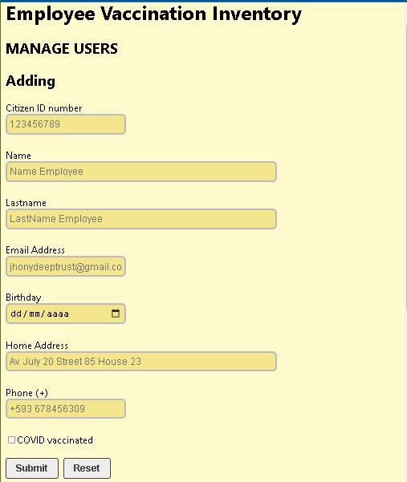
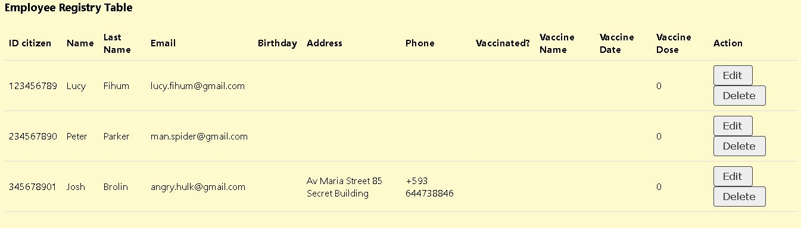

# EMPLOYEE VACCINATED INVENTORY - REACTjs

## **Description**
This project is about a application to record of the Employee vaccinated state. It was developed with [Formik](https://formik.org/) that includes views for listing, adding, editing and deleting records from a JSON server (fake API).

## **Project Structure**

* src

    * components
        
        * [CrudApp.js](./src/components/CrudApp.js)
        * [CrudForm.js](./src/components/CrudForm.js)
        * [CrudTable.js](./src/components/CrudTable.js)
        * [CrudTableRow.js](./src/components/CrudTableRow.js)
    * [App.js](./src/App.js)
    * [index.js](./src/index.js)
    * [index.css](./src/index.css)
* public
    
    * [index.html](./public/index.html)
* [package.json](package.json)
* [README.md](README.md)

## **Views**
### + Registry form

 

### + Employee table

 

### **Deployment**

https://crispthoalex.github.io/employee-vaccination-inventory/

#### **Follow me** 💬

| **Authors** | **GitHub** | **Twitter** | **Linkedin** |
| :---: | :---: | :---: | :---: |
| Crispthofer Rincon | [crispthoalex](https://github.com/crispthoalex) | [@crispthoalex](https://twitter.com/crispthoalex) | [carmurrain](https://www.linkedin.com/in/carmurrain) |

##### April, 2022. Colombia